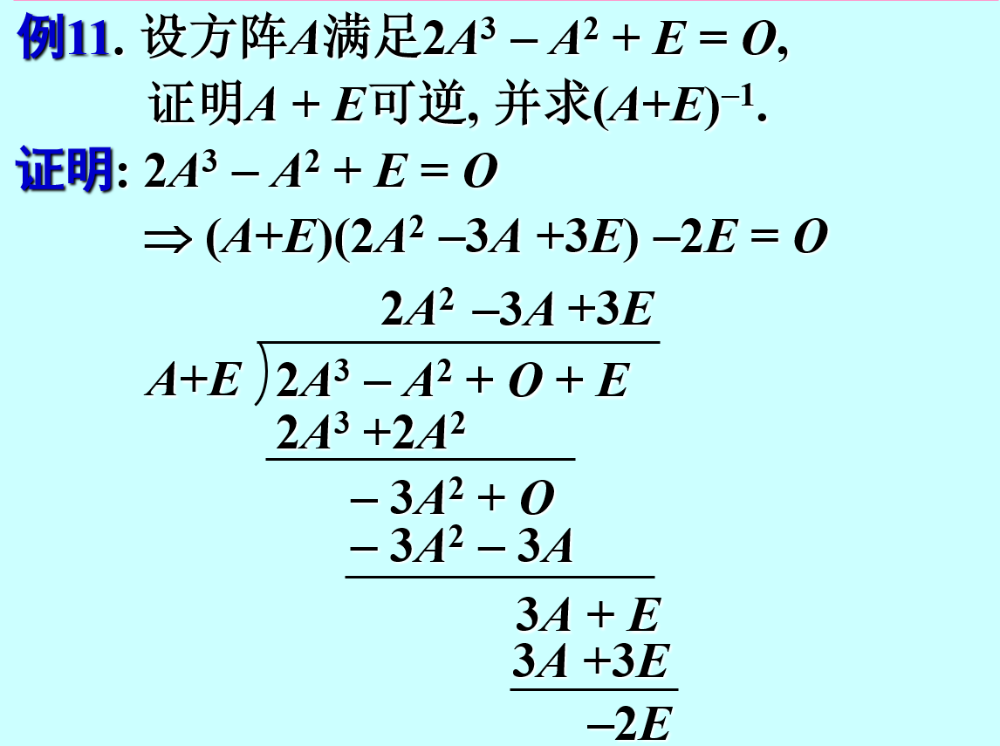
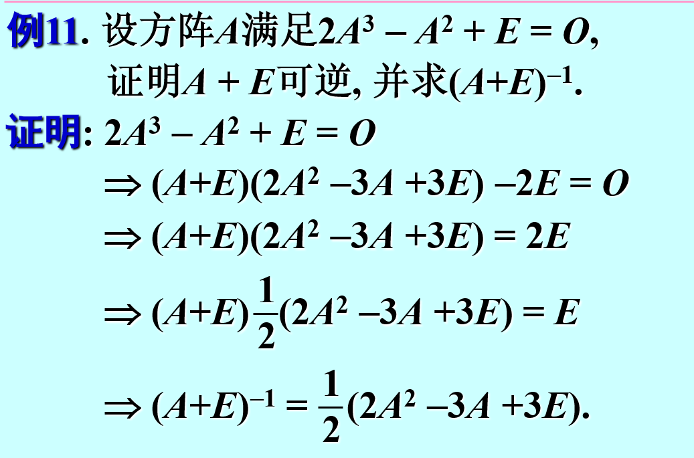
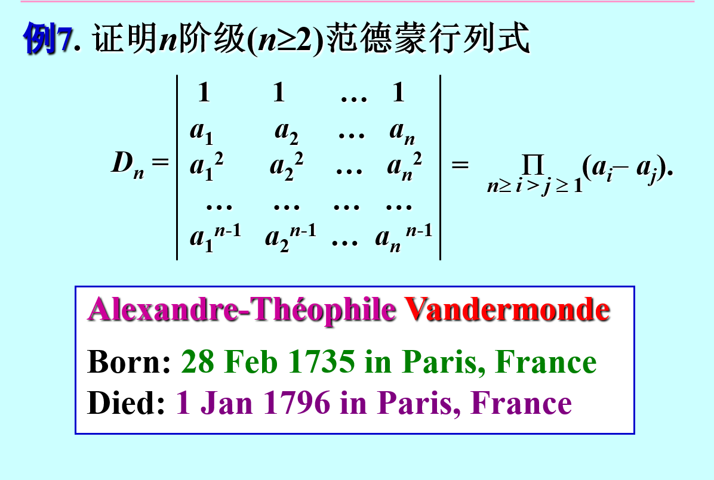
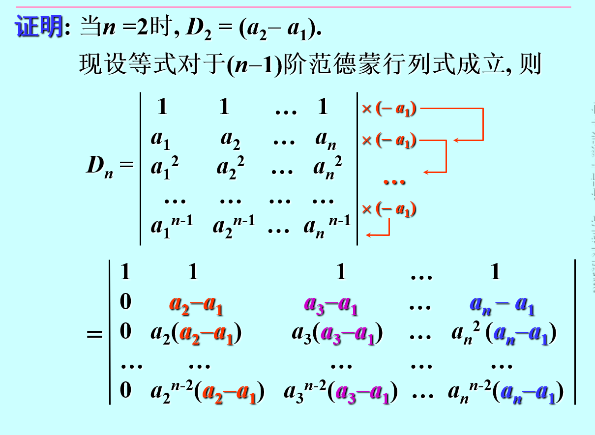
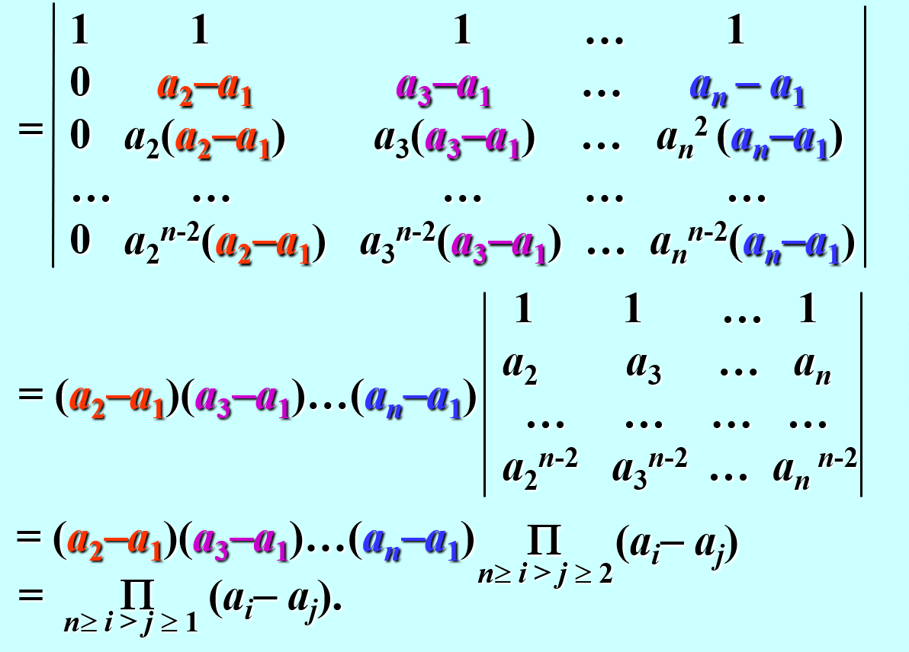
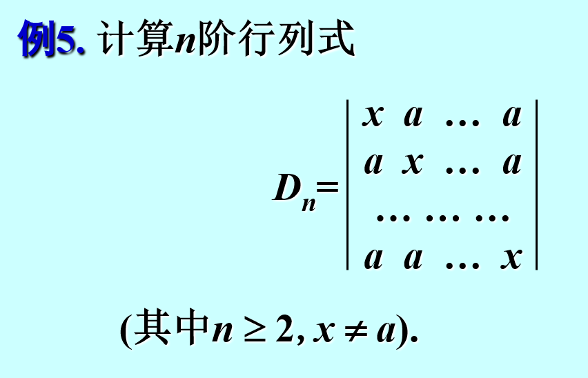
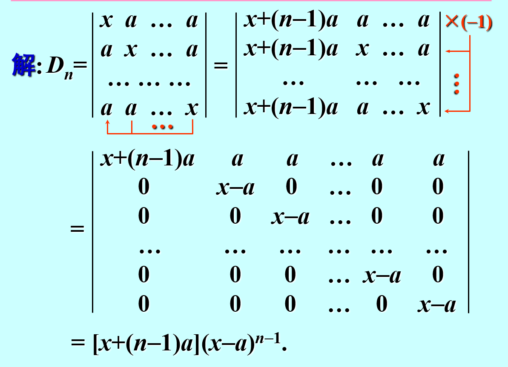
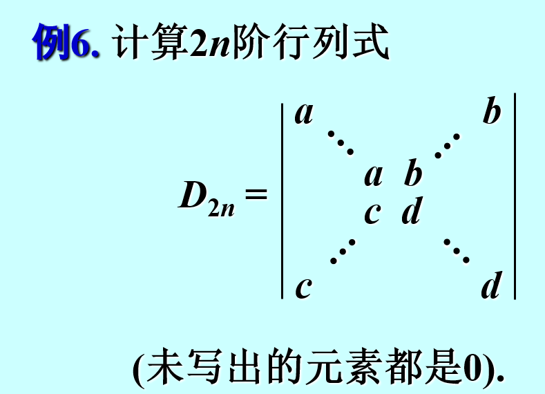
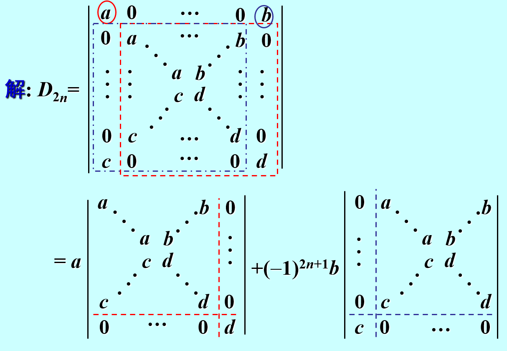
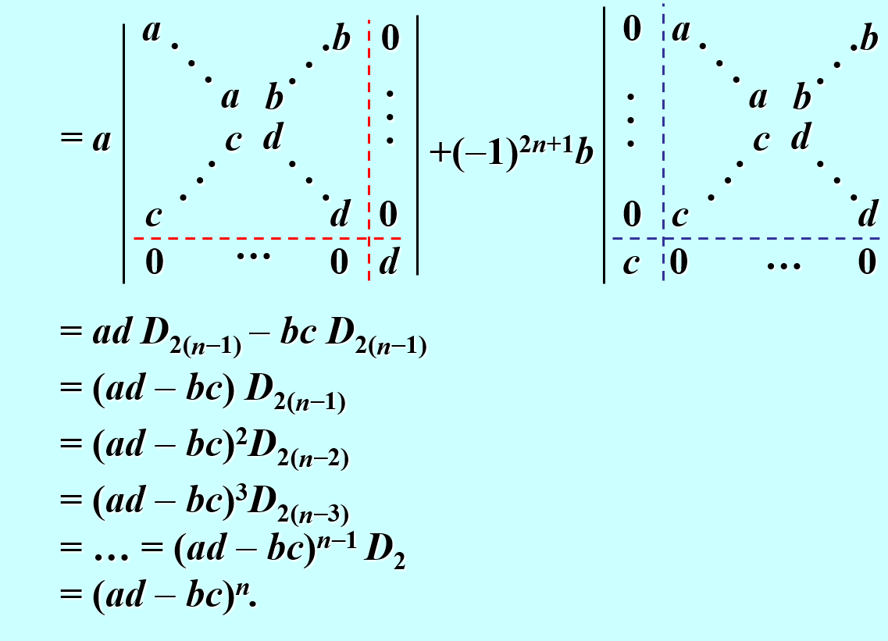

## 逆矩阵

#### 因式分解求逆矩阵

## 行列式

#### 范德蒙德行列式

#### 每行/列元素之和相等

#### 递推/归纳
##### 1.

##### 2.
$\begin{vmatrix}
a+b & ab & 0 & \cdots & 0\\
1 & a+b & ab & \cdots  & 0\\
\\ &  \ddots & \ddots & \ddots\\
\\
 & &\ddots & a+b & ab
\\
& &  & 1 & a+b
 \end{vmatrix}=?$
 解:
 $$
\begin{aligned}
 第一行展开\\D_{n}=(a+b)D_{n_-1}-abD_{n-2}\\D_{n}-bD_{n-1}=a(D_{n-1}-bD_{n-2}) \\D_1=a+b,D_2=(a+b)^{2}-ab \\ D_n-bD_{n-1}=a^{n-2}(a^{2})=a^{n} \\ 同理,D_n-aD_{n-1}=b^{n} \\ \therefore  D_n=\frac{a^{n+1}-b^{n+1}}{a-b}=a^{n}+a^{n-1}b+ \cdots + b^{n}
\end{aligned}
 $$

#### 杂项
##### 1.
$$
A_{3\times 3} ,已知a_{ij}+A_{ij}=0,则\left\vert A \right\vert=? 
$$
解:
$$
a_{ij}+A_{ij}=0 \rightarrow A^{T}=-A^{*}\rightarrow\left\vert A \right\vert =\left\vert A^{T} \right\vert =-\left\vert A^{*} \right\vert =-\left\vert A \right\vert ^{2}
\therefore \left\vert A \right\vert =0/ -1   
$$
$$
\because  \left\vert A \right\vert= a_{11}A_{11}+a_{12}A_{12}+a_{13}A_{13}=-(a_{11}^{2}+a_{12}^{2}+a_{13}^{2})\neq 0
$$
$$
\therefore \left\vert A \right\vert=-1 
$$
