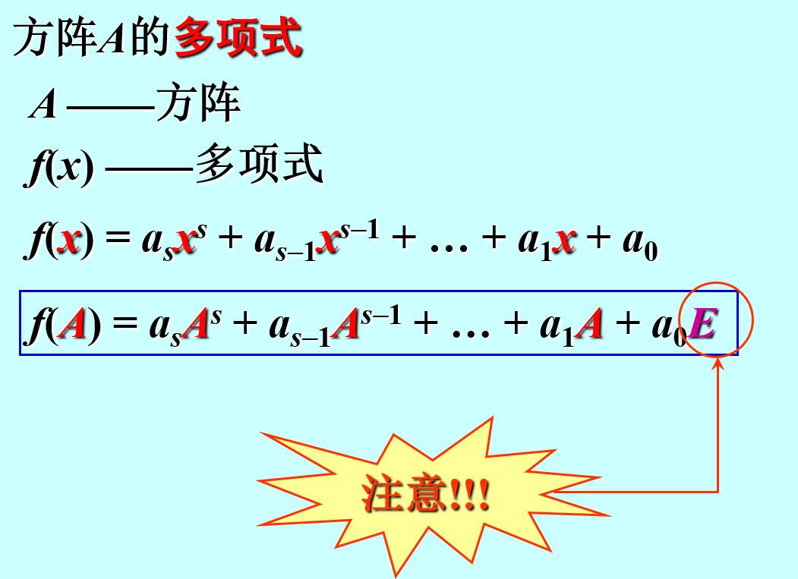
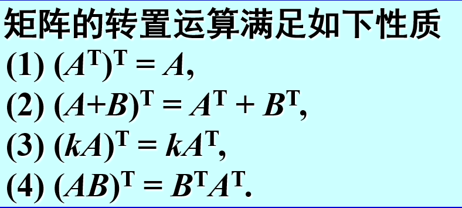
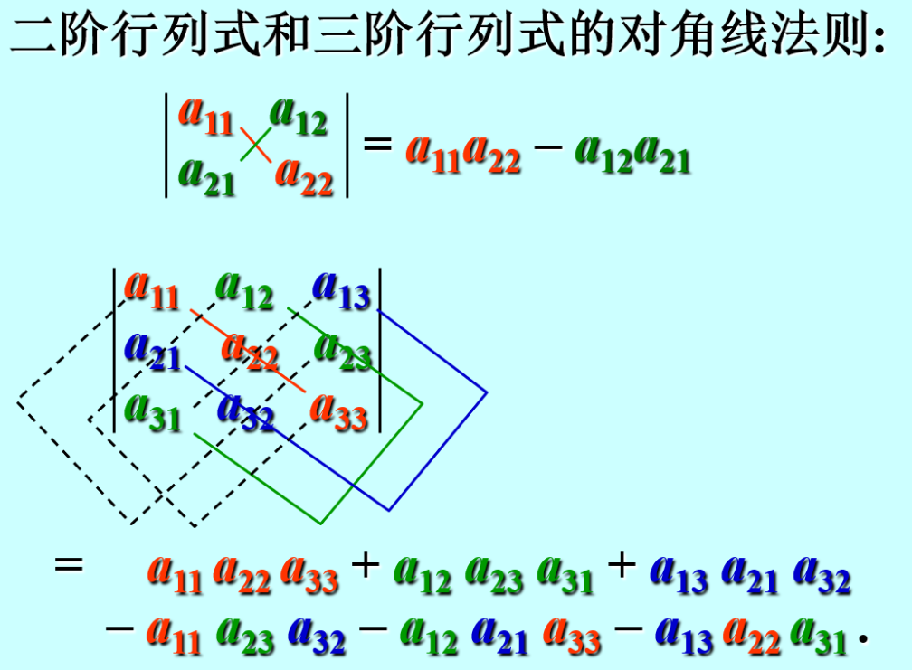
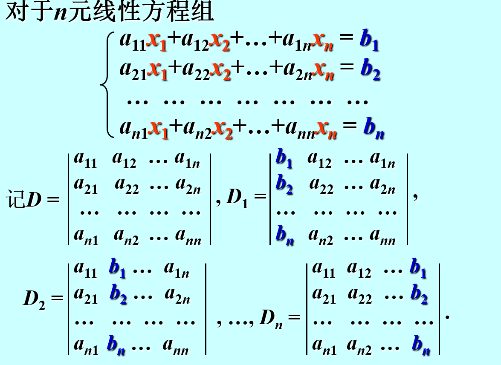
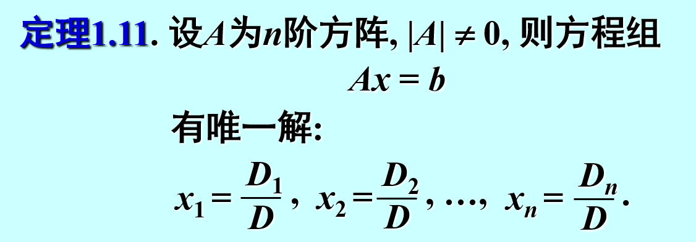

# 特殊矩阵

### 零矩阵
==不止为方阵==
写答案时候要写$0_{nn}而不能直接写0$
### 对角矩阵
通常用 $\land $表示，可记为$\land $=diag($a_{11},a_{12},\dots$)
### 数量矩阵
对角矩阵主对角线上元素相等
### 单位矩阵
==只能方阵==
### 三角矩阵
上三角下三角，主要应用于求行列式及方阵的LU分解
### 行阶梯型矩阵
主要用于求秩
### 行最简型矩阵
用于化成等价标准形
**非零首元同一列其余元素为0**
### 对称矩阵
$A^{T}$=A且$A_{ij}=A_{ji}$
更多性质见特征值章
### 反对称矩阵
$A_{ij}=-A_{ji}$
*故主对角线元素都为0*
### 等价标准形
计算AB=C时将C化成等价标准形（标准分解）有奇效，特别是在AB非方阵的情况下
当秩已知时,$A=P\begin{pmatrix}
E_{r} & 0 \\ 0 & 0
\end{pmatrix}Q=P\begin{pmatrix} E_r    \\ 0 \end{pmatrix}\begin{pmatrix}
E_r &0
\end{pmatrix}Q$可用来求各种问题

# 线性运算
$\begin{cases}
    加法 \\ 数乘：kA=O \xrightarrow{} k=0或A=O
\end{cases}$

# 矩阵的乘法
### 运算法则
==结合律==：(AB)C=A(BC)
==分配律==:A(B+C)=AB+AC *注意左乘右乘*
~~交换律~~：AB$\neq $BA  *同阶对角矩阵及逆矩阵满足交换律*
~~消去律~~：A=O,AB=AC$\Rightarrow$B=C 未必成立

$(A+B)^n=\sum_{i=0}^nC_n^iA^{i}B^{n-1}$   **当A=B时成立**

### 特殊矩阵的幂
$$
A=
\begin{bmatrix} 
    1 & 1\\0 & 0 
\end{bmatrix}  ，A^{k}=A
$$

$$
B=\begin{bmatrix} 
    1 & 0\\ 1 & 0 
\end{bmatrix} , B^{k}=B
$$
### 多项式

### 注意点
$$
(A+B)^{2}=A^{2}+B^{2}+AB+BA
$$
$$(A+B)(A-B)=A^{2}+BA-AB-B^{2}$$

# 矩阵的转置

# 分块矩阵
**$按列分块\rightarrow行向量$
$按行分块\rightarrow列向量$
分块对角矩阵**
$\land ^{T} $=diag($a_{11}^{T},a_{12} ^{T},\dots$)

# 初等变换
1. 对换变换
2. 倍乘变换
3. 倍加变换
**若矩阵A经过有限次初等变换化为B, 则称A与B等价(equivalent). 记作$A\cong B$**

$E^{(r)}_{m \times n}为A_{m\times n}$的等价标准形
任何一个矩阵都可以经过有限次初等变换化为标准形.
*变换技巧：按从第一列到最后一列的顺序，先将A变换为行最简形再变为等价标准形*

# 初等矩阵
>对换矩阵 倍乘矩阵 倍加矩阵

初等矩阵左乘：行变换
初等矩阵右乘：列变换

# 逆矩阵
初等矩阵的逆矩阵仍为初等矩阵 
==只有方阵有逆矩阵==
### 性质
1. 唯一性
2. $(A^{-1})^{-1}=A$
3. $(A^{T})^{-1}=(A^{-1})^{T}$
4. $(kA)^{-1}=k^{-1}A^{-1}$
5. $(AB)^{-1}=B^{-1}A^{-1}$
6. A可逆$\rightarrow$A可写成初等矩阵的乘积. 
7. $A_{m\times n}=P_{m} \begin{bmatrix} 
    E^{r}&0\\0&0  
    \end{bmatrix} Q_{n}$  
    称为A的标准分解
8. 行列式$\neq $ 0
9. 分块对角矩阵$A^{-1}=\operatorname{diag}(A_1^{-1},A_2^{-1},\cdots,A_s^{-1})$
### 求逆矩阵
1. 合并矩阵再行/列变换
2. $A^{-1}=\frac{1}{\left\vert A \right\vert }\times A^{*}$
3. ~~待定系数~~
4. 已知等式再因式分解（[见此](1.%E5%85%B8%E9%94%99%E9%A2%98.md#因式分解求逆矩阵))

# 行列式
### 定义
>
$$
\begin{aligned}
在n阶行列式中, 把元素a_{ij}所在的第i行 
和第j列划去\\ 留下来的阶行列式叫做元素 
aij的余子式, 记作Mij, \\令Aij = (-1)^{i+j} M_{ij}
并称之为aij的代数余子式(cofactor).
\end{aligned}  
$$

$\left\vert A \right\vert =\sum_{j=1}^na_{ij}A_{ij},A=(a_{ij})_{n\times n}$

### 性质
1. $\left\vert A^{T} \right\vert=\left\vert A \right\vert  $
2. $A\xrightarrow{一次对换变换}B,\left\vert A \right\vert=-\left\vert B \right\vert  $
3. 若行列式 D 中有两列完全相同,  则  D = 0$\xrightarrow{}$若行列式 D 中有两列元素成比例,则D=0.
4. 某一列/行×k,则行列式×k
==故$\left\vert A_{n\times n} \right\vert=a,则\left\vert kA_{n\times n} \right\vert=k^{n}a  $==
5. **倍加变换不改变行列式的值**
6. n阶方阵A B，$\left\vert AB \right\vert=\left\vert A \right\vert\left\vert B \right\vert   $ **(仅对同阶方阵成立)**
7. $a_{i1}A_{j1}+a_{i2}A_{j2}+\cdots+a_{in}A_{jn}=0,i\neq j$
即不同行的代数余子式与某行元素乘积之和为0
8. $\left\vert A \right\vert \left\vert A^{-1} \right\vert  =\left\vert A A^{-1} \right\vert=\left\vert E \right\vert=1  $

### 行列式计算
1. 对角线法则
2. **!!!初等变换为三角矩阵**
3. 按含0较多的行/列展开
4. 分块对角矩阵$\begin{bmatrix} 
    A&B\\ 0&C 
    \end{bmatrix}和\begin{bmatrix} 
    A&0\\ B&C 
    \end{bmatrix},D=\left\vert AC \right\vert  $

### 伴随矩阵
$$
A_{n\times n}已知，则A^{*}=\begin{bmatrix} 
    A_{11}&A_{21}&\cdots &A_{n1}\\
    A_{12}&A_{22}&\cdots &A_{n2}\\
    \vdots&\vdots & &\vdots\\
    A_{n1}&A_{n2}&\cdots &A_{nn}
\end{bmatrix} 
$$
**(顺序类比$A^{T}$，交换行列)** 
**只有方阵有伴随矩阵**

==特殊==

$A=\begin{bmatrix} 
    a & b \\ c & d 
\end{bmatrix},A^{*}=\begin{bmatrix} 
    d & -b \\ -c & a  
\end{bmatrix}$

#### 性质
1. $AA^{*}=A^{*} A=\left\vert A \right\vert E$
2. $A^{-1}=\frac{1}{\left\vert A \right\vert }A^{*}$
3. $\left\vert A^{*} \right\vert=\left\vert A \right\vert^{n-1}  $
4. $(A^{-1})^{*}=(A^{*})^{-1}=\frac{A}{\left\vert A \right\vert }$
5. $(A^{*})^{*}=\left\vert A^{*} \right\vert (A^{*})^{-1} =\left\vert A \right\vert ^{n-1} \frac{A}{\left\vert A \right\vert }=\left\vert A \right\vert ^{n-2}A$
6. $((A^{*})^{*})^{*}=(\left\vert A \right\vert ^{n-2}A)^{*}=\left\vert A^{*} \right\vert ^{n-2}A^{*}=\left\vert A \right\vert ^{(n-1)\times (n-2)} \left\vert A \right\vert A^{-1}=\left\vert A \right\vert ^{n^{2}-3n+3}A^{-1} $

#### 克拉默法则

# 矩阵的秩
$r(A)=r\begin{cases}
    A中至少有一个r阶子式D不为零 
 \\A的所有r +1阶子式都等于零 
\end{cases}$
 零矩阵的秩规定为0
 方阵的秩若等于n，则其满秩

### 基本性质
1. 初等变换不改变秩
2. $r(A^{T})$$ = r(A$)
3. r(A)=r(PA)=r(AQ)=r(PAQ),P Q为可逆矩阵

### 重要关系
1. $\max_{r(A),r(B)  }\le r(A,B)\le r(A)+r(B)$

2. $r(A)+r(B)-n \le r(AB) \le \min_{ r(A),r(B)},对于A_{m\times n},B_{n\times t}$
3. r$\begin{bmatrix} 
    A&0\\C&B 
    \end{bmatrix}\ge r(A)+r(B) $
4. $A_{s\times n}B_{n\times r}=0,则r(A)+r(B)\le n$（由2.推出）
5. $r(A^{*})=\begin{cases}
    n,r(A)=n \\ 1,r(A)=n-1\\0,r(A)<n-1
    \end{cases}$
6. $A_{m\times n}=P_{m\times m} \begin{bmatrix} 
    E_{r} &0\\0&0 
    \end{bmatrix}_{m\times n} Q_{n\times n}$
7. $设A为s\times n矩阵,证明r(A)=1的充要条件是存在非零 s 维列向量 \xi 和非零 n 维列向量\eta, 使得A =\xi \eta ^{T}  $

### 求秩
将矩阵初等变换为行阶梯型，阶梯数（非零行数目）即为秩