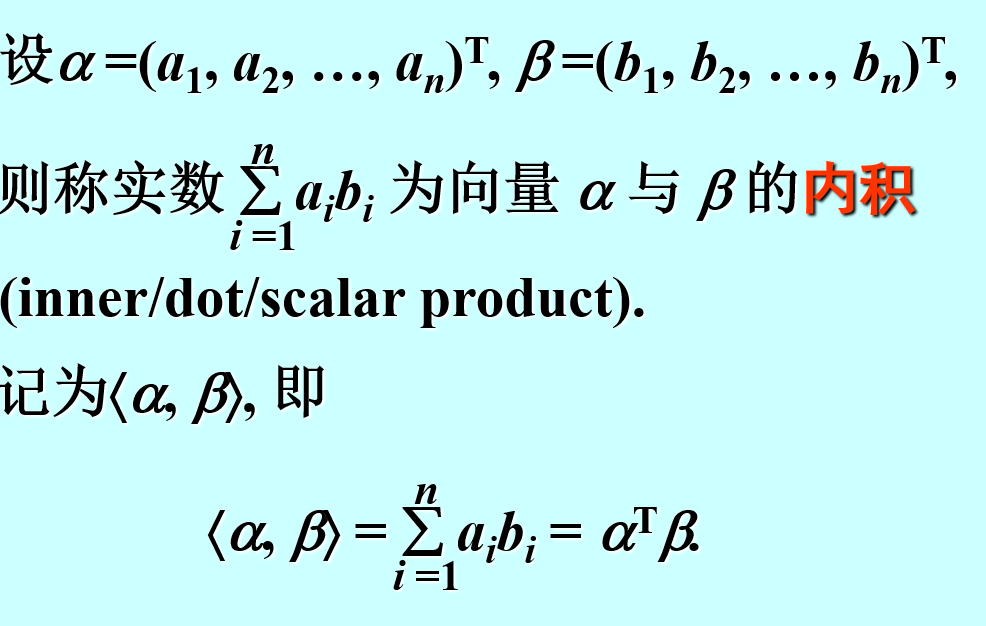
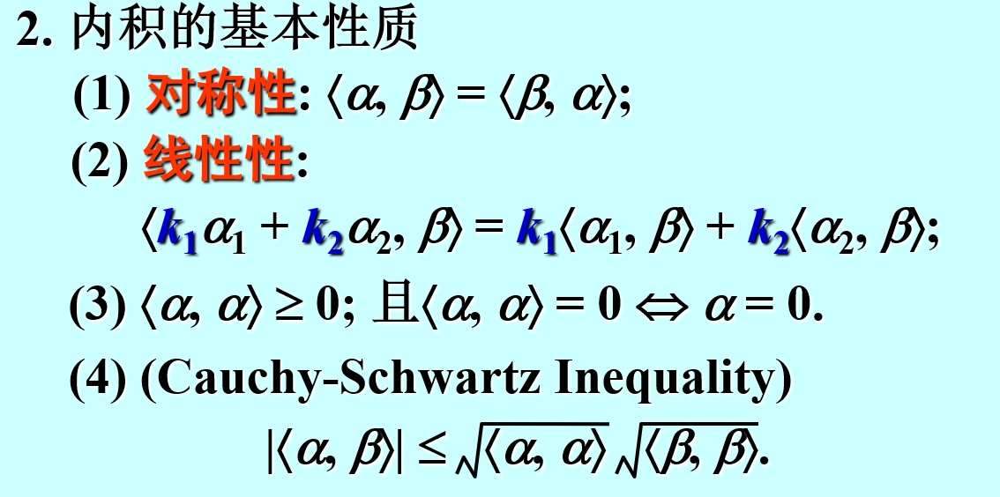
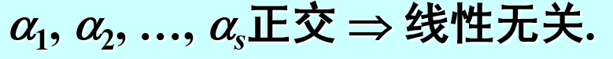
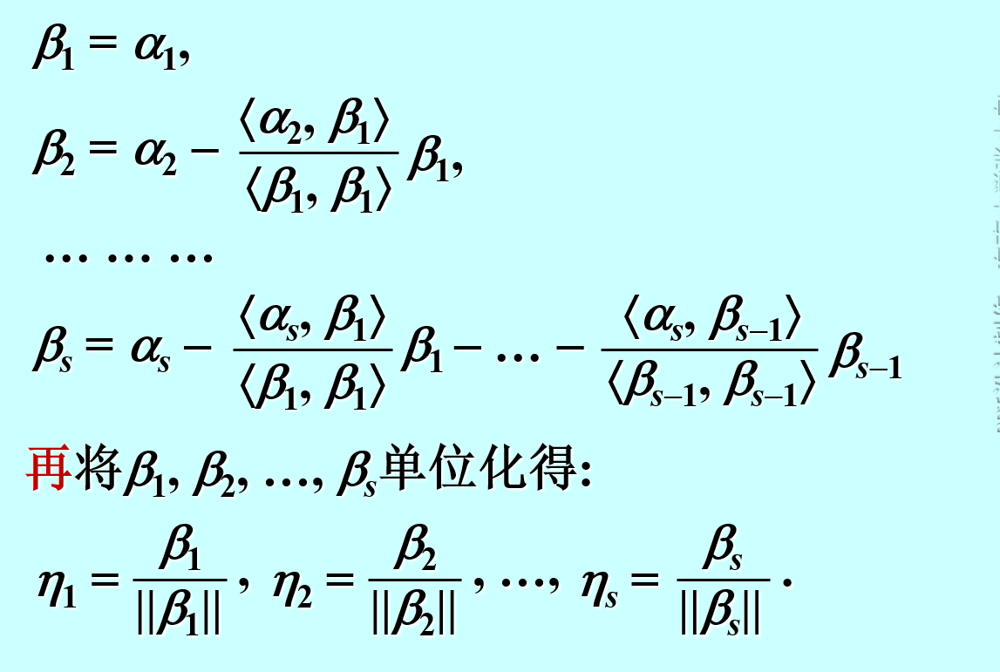
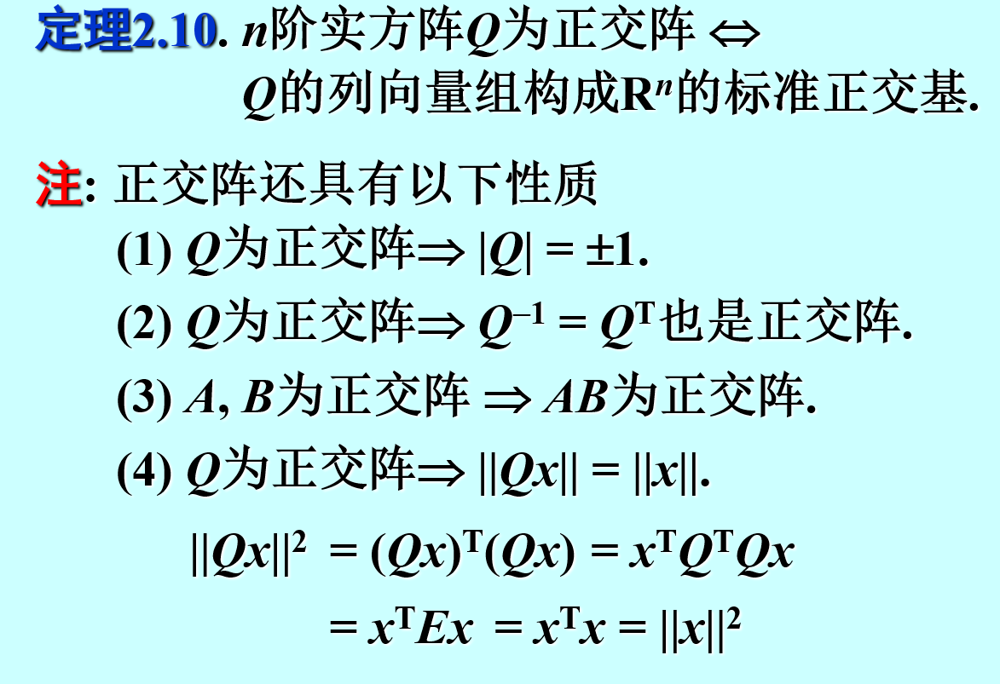

# 内积
## 定义

## 性质
1. 
2. $\left\vert \left\vert \alpha + \beta  \right\vert  \right\vert\le \left\vert \left\vert \alpha \right\vert  \right\vert +\left\vert \left\vert \beta \right\vert  \right\vert  $
3. $<\alpha,\beta>  =0,则称\alpha ,\beta 正交 $
4. 

## 标准正交基
$a_1,a_2, \ldots ,a_n是V的一组基，两两正交且都为单位向量（模=1）$

## 施密特正交化
求解标准正交基
1. 先任意求解出一组基$a_1,a_2, \ldots ,a_n$
2. 

# 正交矩阵
$Q^{T}Q=E 或者Q^{-1}=Q^{T}$
## 性质
