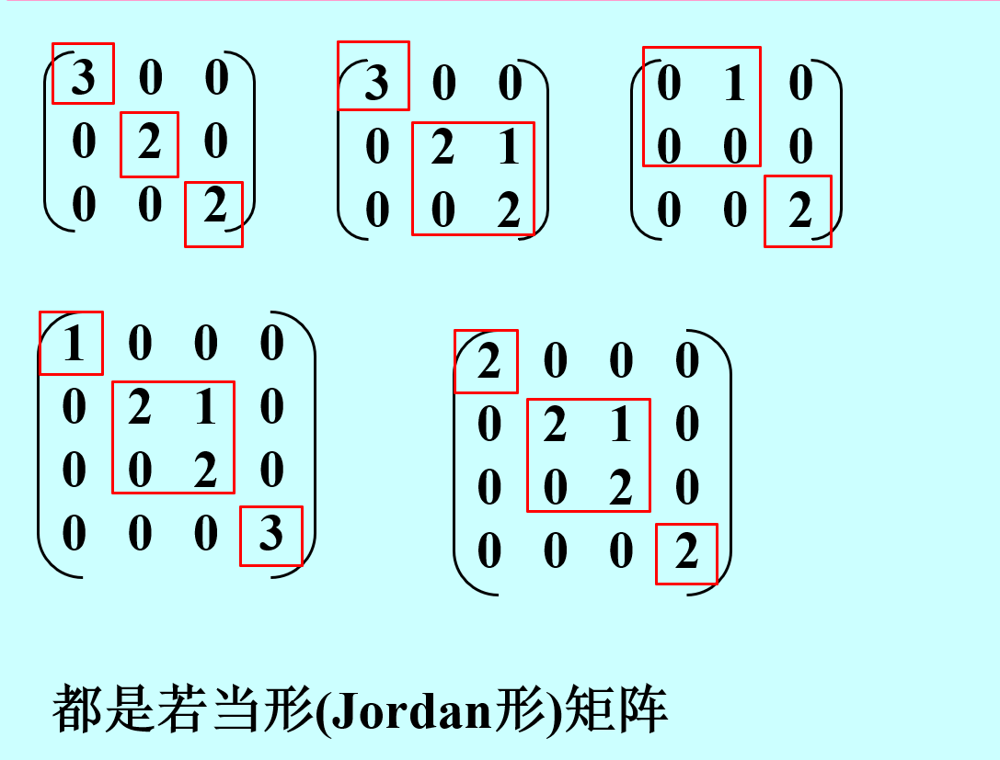
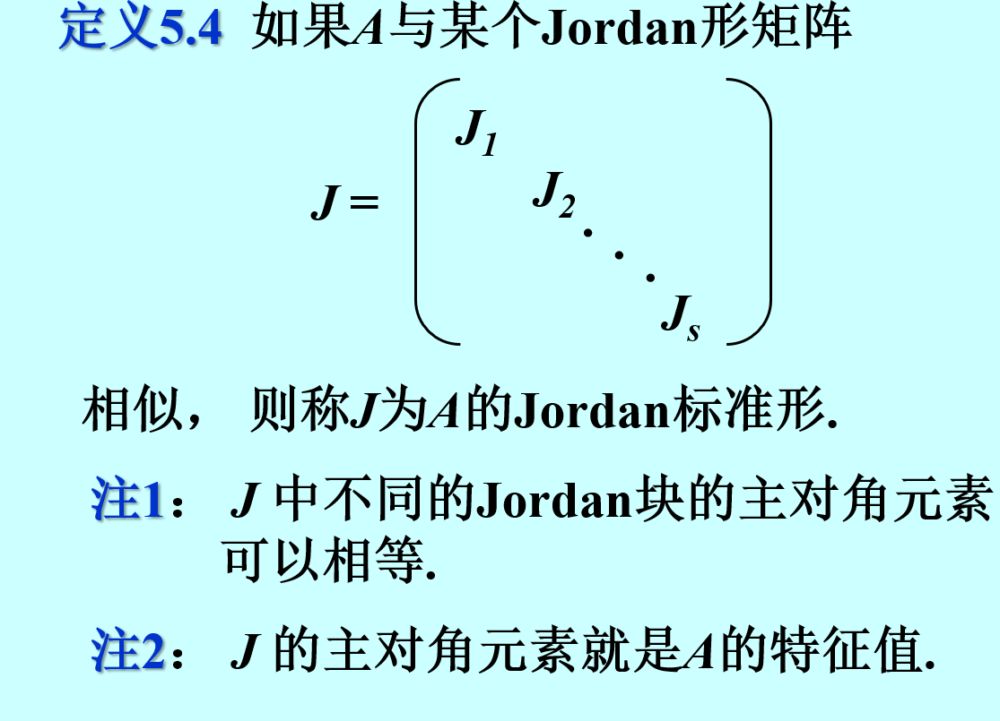
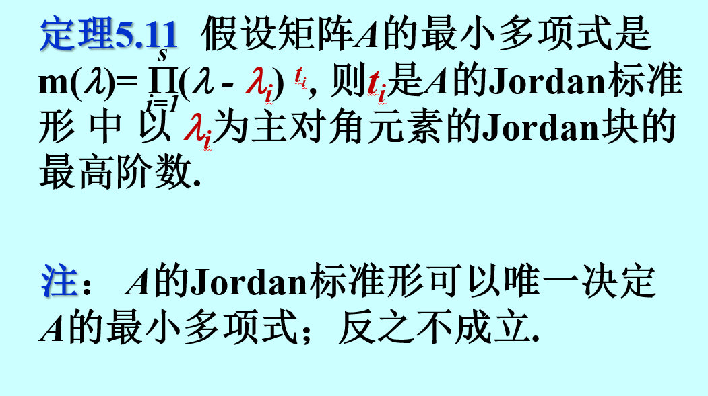

## 迹
>tr:迹，方阵主对角线上数之和

$tr(A+B)=tr(A)+tr(B),tr(kA)=k tr(A)$
**$tr(AB)=tr(BA)$**
$tr(A^{*})=A_{11}+A_{22}+ \cdots +A_{nn}$
## 相似矩阵
> $A,B是n阶方阵，若存在P，使P^{-1}AP=B,则称A与B相似，$A~B

### 性质
1. A~B,则多项式f(A)~f(B)
2. 相似矩阵行列式相同
3. 相似矩阵秩相同
4. 相似矩阵迹相同

5. 相似矩阵特征多项式相同，特征值相同
若A~对角矩阵，则称A可相似对角化,该相似矩阵为相似标准形

## 特征值与特征向量
> $A\xi=\lambda\xi,\lambda为特征值，\xi为特征向量$
> $\left\vert \lambda E-A \right\vert=0 是特征方程 $

1. ==特征向量不能为0向量==
2. 通过解特征方程可解得特征值
   可优先通过行列变换将某项变为0，且其同行/列的另外两项可提出关于$\lambda$的公因式
3. 特征值个数=A的阶数（计算重根） *问A的特征值是？有重根需要回答$\lambda_1=\lambda_2=\lambda$*
4. 特征向量通过求$(\lambda E-A)x=0$的基础解系而求出
5. $tr(A)=\sum_{}\lambda$
6. $\left\vert A \right\vert=\prod \lambda  $
7. 特征值用来判断秩（非0特征值个数=秩）
8. $f(A)=B,则\lambda_{B}=f(\lambda_{A})$
9. $\begin{cases}
    A:\lambda \\ A^{-1}:\frac{1}{\lambda} \\ A^{*}:\frac{\left\vert A \right\vert }{\lambda} \\ A^{T}:\lambda 
\end{cases}$
==特征向量都相同==
10. 单位列向量$a,则aa^{T}的特征值是1和n-1个0$
    $(aa^{T})^{2}=aa^{T}aa^{T}=aa^{T},所以\lambda^{2}=\lambda,\lambda=1/0$
    $\because \operatorname{tr}(aa^{T})=a_1^{2}+a_2^{2}+ \cdots +a_n^{2}=1\therefore\lambda_1=1,\lambda_2=\lambda_3=\cdots =\lambda_n=0$

## 对称矩阵的性质
1. 不同特征值对应的特征向量正交
2. 必可相似对角化，且能正交相似对角化
   求法：同一个特征值对应的特征向量施密特正交化，之后再单位化
## 特征多项式与最小多项式
特征多项式$f(\lambda)=\left\vert \lambda E-A \right\vert$
最小多项式：特征多项式中的各项组合能使$m(\lambda)=0$且次数最小的多项式，最高项系数为1

## Jordan标准型

求解Jordan标准型：求特征值，列出所有可能的Jordan矩阵，再通过$r(\lambda E-A)=r(\lambda E -Jordan)求出，其中不是所有\lambda都可算出结果$

## 可相似对角化条件
1. 对称矩阵
2. 有n个线性无关的特征向量
**解题时可从$(\lambda E-A)x=0,基础解系中解的数量=n-r(\lambda E-A)入手$**
3. 最小多项式无重根
4. $\left\vert \lambda E-A \right\vert=(\lambda-\lambda_1)^{k_1}(\lambda-\lambda_2)^{k_2}(\lambda-\lambda_3)^{k_3}\cdots (\lambda-\lambda_i)^{k_i}，\lambda_i恰好有k_i个线性无关的特征向量$