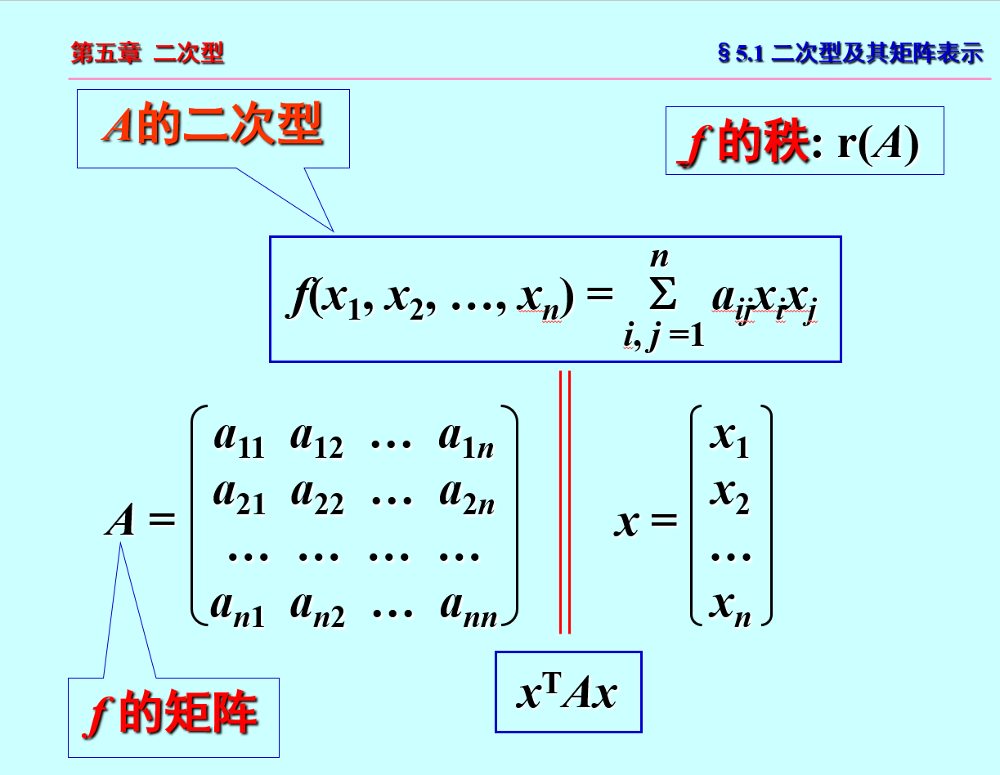
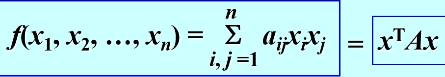
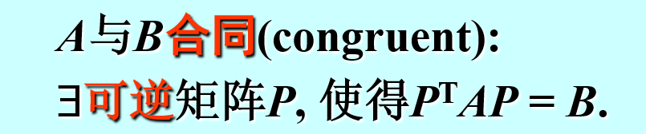
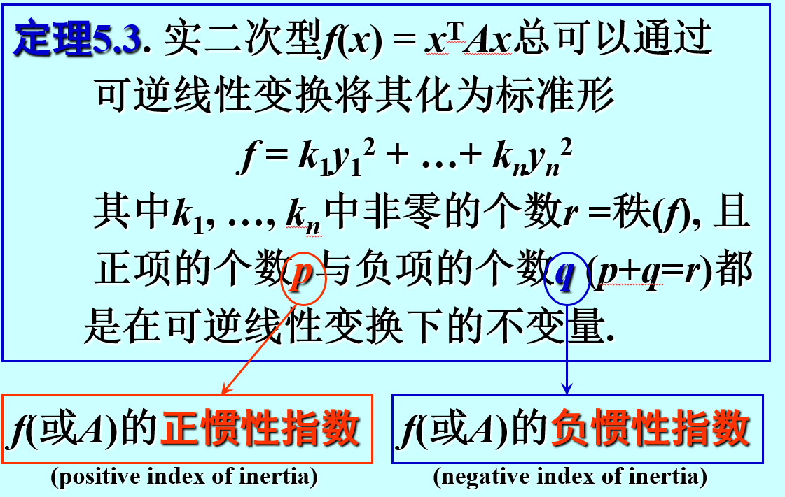
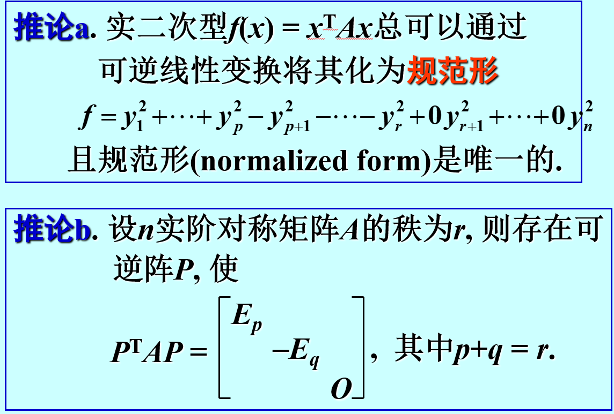

## 定义

注意$\sum_{}a_{ij}x_i x_j形式与x^{T}Ax的转换$
=

标准型：没有交叉项只有平方项

且$x_i,x_j可以为n阶矩阵$
==
## 合同

### 判断
正负惯性指数相同（或者正惯性指数相同，秩相同）

正惯性指数+负惯性指数=秩
==

### 定理

且该矩阵对角线上元素为其特征值

## 将二次型转化为标准型
==能配方优先配方==
问求正交矩阵就是用正交变换
问求可逆线性变换就是用配方法
### 正交变换
1. 求A的特征值
2. 求A正交相似对角化对应的对称矩阵Q
3. x=Qy,$f(x_1,x_2, \ldots ,x_n)=\lambda_1y_1^{2}+\lambda_2y_2^{2}+ \cdots +\lambda_n y_n^{2}$

### 配方法
1. $x_1$在平方项中但不在交叉项中 
   *$将x_2与x_3配方，变成(x_2+ax_3)^{2}+bx_3^{2}$*
2. $x_1$在平方项和和多个交叉项中 
   *$将x_1与(x_2-x_3)整体进行配方，剩下的部分配方$*
3. $x_1, x_2, x_3$在交叉项中但不在平方项中 
   *$令x_1=y_1+y_2,x_2=y_1-y_2,x_3=y_3,再进行二次配方$*

#### 求x=Qy中Q的方法
1. 求出$\begin{cases}
    y_1=ax_1+bx_2 \\y_2=cx_1+dx_2 \\ y_3=ex_1+fx_2
    \end{cases}$
    再得到y=Px,求P的逆矩阵
2. $\begin{cases}
    y_1=ax_1+bx_2 \\y_2=cx_1+dx_2 \\ y_3=x_3
    \end{cases}$
    由下至上,得到$x_i=\sum_{}y_i$,然后得到Q

## 正定二次型

p=A特征值中正项数，q=A特征值中负项数
p-q=2p-r:符号差
==

规范型正项在前负项在后，系数都为1/-1
==

